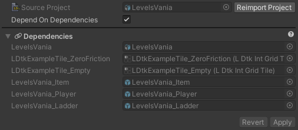
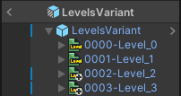

# Level Importer

In addition to the imported project, separate level files can also be imported.

The file format for imported separate level files is `.ldtkl`.  
  

There are a number of benefits to using level files:
- Helps enable modular level design. (ex. randomly-generated dungeon with levels for dungeon pieces)
- Only the necessary level assets are loaded into memory at any given time.

## Inspector
The importer inspector displays a reference to the level's project which can be clicked to locate the project in the hierarchy window.  
The project can also be re-imported from here with a quick button.

## Reimport
The imported level files depend on the project file to be imported properly.  
Consider reimporting the project file before the level if there are also import issues with the project.  
If there are any import problems with separate levels, make sure it's source project is properly imported.  

## Important
*This issue may be fixed in the future, but important to follow for now.*  
Due to technical issues related to how prefabs are imported, it is **not** recommended for LDtk projects/levels to be nested inside prefab and prefab variants:  

