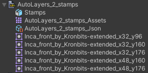

# Project Importer

Store the LDtk project file in the Unity project so that it can be imported.

The file format must be `.ldtk`.  
  

**Simply drag-and-drop this main asset into the scene.**  
  

## Inspector
The importer inspector is composed of several sections:   
[**Main**](topic_Section_Main.md), 
[**IntGrids**](topic_Section_IntGrids.md), 
[**Entities**](topic_Section_Entities.md), 
and [**Enums**](topic_Section_Enums.md).

- After making any changes, click the apply button at the bottom to reimport.
- If any section is hidden, it's because there were no associated definitions in the LDtk project.

## Hierarchy
The imported project generates a hierarchy of GameObjects:  
- Project Root
    - Levels
        - Layers
            - Entity/Tilemap GameObjects
    

## Sub-Assets
In addition to the generated GameObjects, some other sub-assets are also generated:
- [**Artifact Asset**](../Topics/topic_ArtifactAssets.md)
- [**Json Project**](../Topics/topic_ProjectFile.md)
- Sprites
  - The sprites are used in Auto-Layers and Tile-Layers, but can also can be referenced for any needs.
    
   

## Reimport
If there are any problems in the import process, try reimporting.  
  If there are still problems, [**post an issue on GitHub**](https://github.com/Cammin/LDtkUnity/issues).  
  

