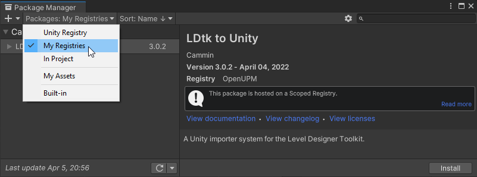
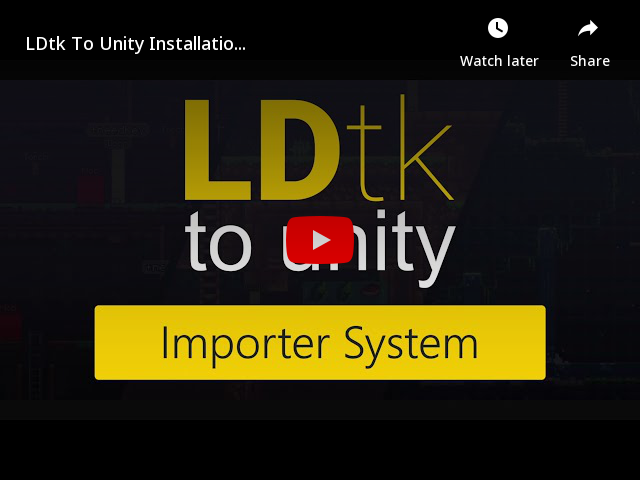

# Install

There are a few install methods.  
If you have issues, look towards [Troubleshooting](../Topics/topic_Troubleshooting.md).

## Easy Install 
###### (2019.4+ only)
- In Unity, Go to `Edit > Project Settings > Package Manager`
- Create a new scoped registry:
  - Name: `OpenUPM`
  - URL: `https://package.openupm.com`
  - Scope(s): `com.cammin.ldtkunity`
- Click Save. Now the package is downloadable from the package manager.


- Go to the Unity Package Manager window and select `My Registries` then select install.




### Video
This video showcases the following a couple of the install methods.
[](https://youtu.be/ah5MLaU5m8s)

## OpenUPM CLI Option
- [Install the OpenUPM-CLI](https://openupm.com/docs/getting-started.html#installing-openupm-cli) if not installed already.
- [Install the LDtkUnity Package](https://openupm.com/docs/getting-started.html#installing-a-upm-package) by entering this into the command line while the directory is scoped on the root of your Unity project:  
```
openupm add com.cammin.ldtkunity
```

## Via .unitypackage
- Download a `.unitypackage` from the [Releases](https://github.com/Cammin/LDtkToUnity/releases) section of the Github repo.
- Drag it into Unity to install. It will be installed into your Assets folder, which is particularly useful for ease of code modification
- Use these instead if it's a better option for you. But otherwise, the package manager is still the recommended installation method.
- When installing from a `.unitypackage`, ensure that the importer is uninstalled from the package manager (if applicable)
- When updating from an old `.unitypackage`, ensure that the previous installation is deleted before installing a new one.


## Note
- *Minimum* supported Unity version 2019.3.
- This package uses [*Newtonsoft Json Unity Package*](https://docs.unity3d.com/Packages/com.unity.nuget.newtonsoft-json@3.0/manual/index.html) as the tool to deserialize a LDtk json files.   
  It is automatically installed alongside; no worries.
- This package also additionally includes the `Utf8Json` library to deserialize with significant performance. 


### Early Access
- If you would like to try out the latest in-development package commit, then download/fork the repo for the most recently updated branch, and reference the `package.json` file from the Unity Package manager.
  - Understand that these may be buggy or outright broken.