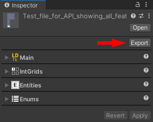

# Export Native Prefab

It is possible to export a prefab, independent of an imported LDtk project.  
  

This prefab uses assets and components that are entirely native to unity, so it could function properly even if LDtkToUnity was uninstalled.

This can be useful if there was a need to uninstall the LDtkToUnity package, but still want to maintain the level designs in Unity.

, you can export a prefab and assets to a folder.

There is a button in the importer inspector to export to a native prefab.
this prefab would be able to work

To make the prefab with native unity components/assets, changes are made:  

- Assets are crated:
  - All `LDtkArtTile`s will be exported to Unity's `Tile` asset. It will have it's associated exported sprite.
  - All `LDtkIntGridTile`s will be exported to Unity's `Tile` asset. It will maintain it's proper collision
  - All sprites are cloned, and associated to their corresponding new tiles.

- Components will be removed throughout the hierarchy:
  - `LDtkComponentProject`
  - `LDtkComponentLevel`
  - `LDtkFields`
  - `LDtkDetachComponent`
  - `LDtkEntityDrawerComponent`
  

- All tilemaps in the hierarchy will be replaced by their new native tile assets.

To begin exporting a native prefab, click the `Export` button in the importer inspector of an LDtk Project to open a new window.  
  

Inside the window is a prefab field to assign   

however, there will be some missing information:
-LDtk Fields

note:
The same tileset texture is still depended on.

